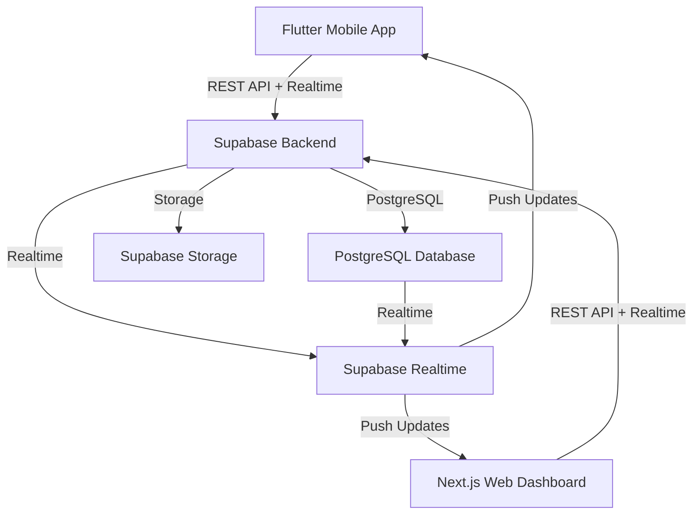

# System Architecture

## High-Level Overview

The system is a coordination platform designed for emergency response and resource allocation during disasters. It consists of three main components:

1. **Flutter Mobile Application** - For field responders and citizens to report emergencies
2. **Next.js Web Dashboard** - For coordinators to view and manage emergencies
3. **Supabase Backend** - Handles authentication, data storage, realtime updates, and file storage

## Component Diagram

## Data Flow

1. **Emergency Report Creation**:
   - User fills out form in Flutter app
   - App captures GPS location
   - Submits data to Supabase via REST API
   - Data inserted into `emergency_requests` table

2. **Realtime Updates**:
   - Supabase Realtime listens for INSERT/UPDATE events on `emergency_requests`
   - When new data is detected, pushes update to all subscribed clients
   - Flutter app and Next.js dashboard both receive updates

3. **Map Display**:
   - Dashboard fetches emergency data with location coordinates
   - MapLibre GL displays markers for active emergencies
   - Markers show popup with emergency details when clicked

## Technology Stack

| Layer | Technology | Purpose |
|-------|------------|---------|
| Mobile | Flutter | Cross-platform UI for emergency reporting |
| Web | Next.js | Server-rendered dashboard with realtime capabilities |
| Backend | Supabase | Authentication, database, realtime, storage |
| Database | PostgreSQL | Relational database for structured data |
| Realtime | Supabase Realtime | Push notifications for data changes |
| Storage | Supabase Storage | File storage for emergency photos |

## Key Architectural Decisions

1. **Supabase as Backend**: Chose Supabase for its realtime capabilities, PostgreSQL integration, and easy Flutter/JS client libraries.

2. **Realtime First Design**: Built realtime functionality from the start rather than as an afterthought.

3. **Location-Centric Design**: All emergency data includes geographic coordinates for mapping functionality.

4. **Role-Based Access Control**: Implemented via PostgreSQL Row Level Security (RLS) policies.

5. **Modular Data Model**: Normalized database schema with clear relationships between entities.

## Emergency Request Lifecycle

1. **Creation**: User submits emergency report via mobile app
2. **Validation**: Client-side validation before submission
3. **Storage**: Data stored in `emergency_requests` table with location coordinates
4. **Realtime Broadcast**: System notifies all connected clients of new emergency
6. **Response**: Coordinators view and assign emergencies through dashboard
7. **Resolution**: Emergency status updated as response progresses

## Error Handling

- Client-side validation before submission
- Server-side validation via Supabase constraints
- Error handling in both Flutter and Next.js clients
- Graceful degradation when network connectivity is poor

## Error Types

- **Validation Errors**: Missing required fields, invalid format
- **Authentication Errors**: Invalid credentials, session expired
- **Network Errors**: Connectivity issues during submission
- **Database Errors**: Constraint violations, foreign key mismatches